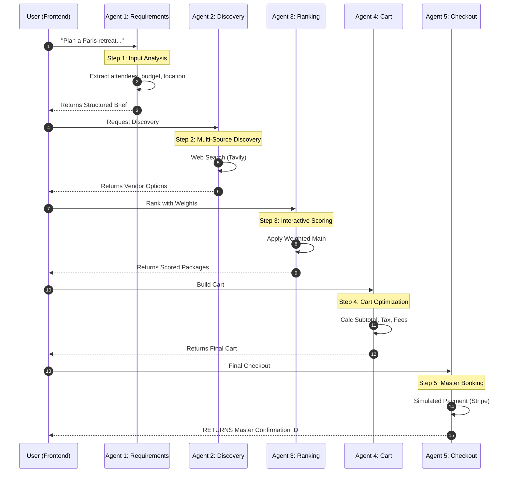
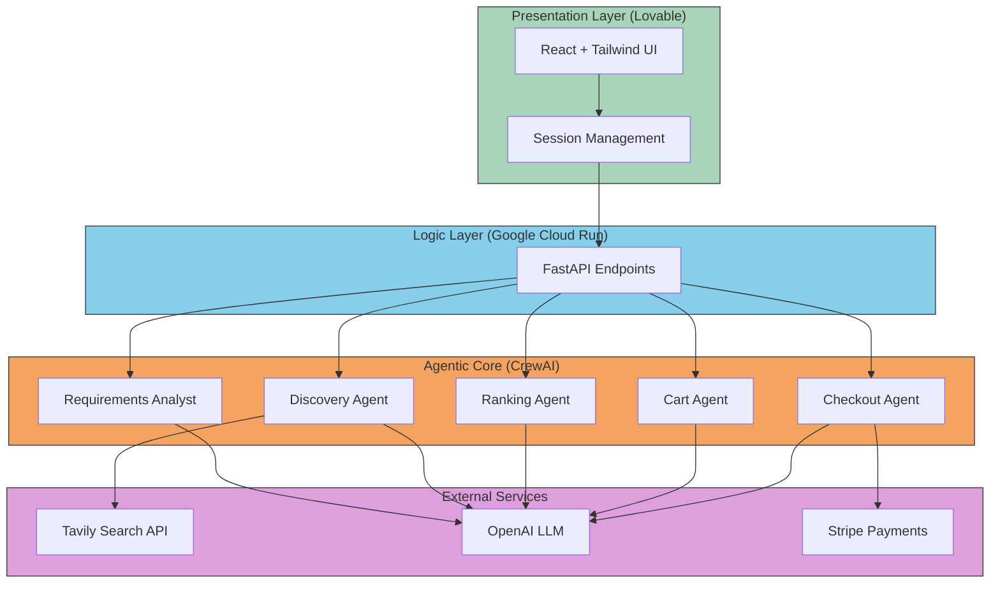

# Retreat Planner Backend

Multi-agent retreat planning backend powered by CrewAI and Tavily.

## 🚀 Quick Start

### Prerequisites
- Python 3.11+
- [uv](https://github.com/astral-sh/uv) package manager

### Installation

```bash
# Navigate to backend directory
cd backend

# Install dependencies with uv
uv sync

# Copy environment template
cp .env.example .env

# Edit .env with your API keys
```

### Required API Keys

| Variable | Description | Get it from |
|----------|-------------|-------------|
| `OPENAI_API_KEY` | OpenAI API key | [OpenAI Platform](https://platform.openai.com) |
| `TAVILY_API_KEY` | Tavily search API | [Tavily](https://tavily.com) |
| `STRIPE_SECRET_KEY` | Stripe test key | [Stripe Dashboard](https://dashboard.stripe.com) |

### Run Locally

```bash
# Start the server
uv run uvicorn src.main:app --reload --port 8000

# Or using the main module
uv run python -m src.main
```

## 📚 API Documentation

Once running, visit:
- **Swagger UI**: http://localhost:8000/docs
- **ReDoc**: http://localhost:8000/redoc

## 🔌 Endpoints

### Flow Endpoints
| Method | Endpoint | Description |
|--------|----------|-------------|
| POST | `/api/v1/analyze-requirements` | Agent 1: Parse requirements |
| POST | `/api/v1/discover-options` | Agent 2: Search vendors |
| POST | `/api/v1/rank-packages` | Agent 3: Rank packages |
| POST | `/api/v1/cart/build` | Agent 4: Build cart |
| POST | `/api/v1/cart/modify` | Agent 4: Modify cart |
| POST | `/api/v1/checkout` | Agent 5: Process checkout |
| POST | `/api/v1/full-flow` | Run all agents (testing) |

### Utility Endpoints
| Method | Endpoint | Description |
|--------|----------|-------------|
| GET | `/` | API info |
| GET | `/health` | Health check |
| GET | `/api/v1/session/{id}` | Get session state |
| DELETE | `/api/v1/session/{id}` | Delete session |

## 📝 Example Usage

### 1. Full Flow (Quick Test)

```bash
curl -X POST http://localhost:8000/api/v1/full-flow \
  -H "Content-Type: application/json" \
  -d '{
    "user_input": "Plan a 2-day retreat in Las Vegas for 50 managers. Budget $60,000. Need 4-star hotel, flights from SF, meeting room, catering."
  }'
```

### 2. Step-by-Step Flow

```bash
# Step 1: Analyze requirements
curl -X POST http://localhost:8000/api/v1/analyze-requirements \
  -H "Content-Type: application/json" \
  -d '{"user_input": "50 people, Las Vegas, 2 days, $60k budget"}'

# Save the session_id from response

# Step 2: Discover options
curl -X POST "http://localhost:8000/api/v1/discover-options?session_id=YOUR_SESSION_ID"

# Step 3: Rank packages
curl -X POST "http://localhost:8000/api/v1/rank-packages?session_id=YOUR_SESSION_ID"

# Step 4: Build cart (use package_id from ranked results)
curl -X POST "http://localhost:8000/api/v1/cart/build?session_id=YOUR_SESSION_ID&package_id=pkg_abc123"
```

## 🎯 Dynamic Scoring

Weights are fully adjustable. Example:

```json
{
  "category_importance": {
    "flights": 25,
    "hotels": 45,
    "meeting_rooms": 15,
    "catering": 15
  },
  "hotels": {
    "price_weight": 20,
    "trust_weight": 50,
    "location_weight": 20,
    "amenities_weight": 10
  }
}
```

## 🏗️ Project Structure

```
backend/
├── pyproject.toml          # Dependencies
├── .python-version         # Python 3.11
├── .env.example            # Environment template
├── Procfile                # Deployment
├── README.md
└── src/
    ├── main.py             # FastAPI app
    ├── config.py           # Settings
    ├── agents/             # 5 CrewAI agents
    ├── crew/               # Crew orchestration
    ├── models/             # Pydantic models
    ├── services/           # Tavily, scoring
    └── utils/              # Validators
```

## 🚢 Deployment

### Environment Variables

Set in your deployment platform:
```
OPENAI_API_KEY=sk-...
TAVILY_API_KEY=tvly-...
STRIPE_SECRET_KEY=sk_test_...
CORS_ORIGINS=https://your-frontend.app
```

### Deploy Command
```bash
uv run uvicorn src.main:app --host 0.0.0.0 --port $PORT
```

## 🏛️ System Architecture Diagrams

These diagrams visualize how your agents collaborate and how the frontend interacts with the backend. Use these for your presentation slides!

---

### 1. Agent Coordination (End-to-End Flow)

This sequence diagram shows how the 5 agents work together to turn a single chat message into a confirmed booking.



---

### 2. Overall System Architecture

Professional block diagram with color-coded layers.



---

### 3. Explaining the Architecture for Judges

| Concept | Description |
|---------|-------------|
| **Agentic Orchestration** | Unlike a traditional app, ours uses CrewAI to manage state. Each agent is a specialist. |
| **Asynchronous Flow** | The high-latency work (web search) is isolated in Step 2, ensuring the rest of the UI feels snappy. |
| **Micro-Services Ready** | Each agent is logically separate, making it easy to add more specialized agents in the future. |

---

## 📄 License

MIT
